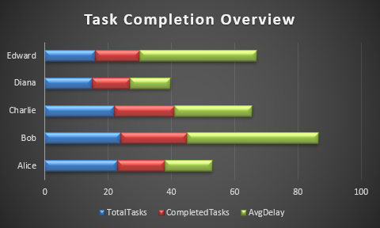
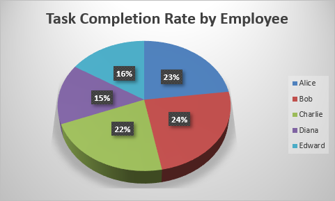

# Employee Productivity and Task Completion Analysis
## Project Overview

This project simulates employee task data, processes it, and performs analysis on task completion, productivity, delays, and status. It uses Python with libraries like **pandas**, **openpyxl**, and **random** to clean, analyze, and visualize employee task data. The project generates dummy employee task data, processes it through an ETL pipeline, and produces insightful analysis reports to help understand employee productivity.

## Idea Description

The main goal of this project is to analyze employee task data, specifically:
1. **Task Completion**: Track and analyze how many tasks each employee completes within the assigned deadlines.
2. **Productivity Metrics**: Calculate and analyze metrics like task completion rates, average completion delays, and overdue tasks.
3. **Task Delays**: Examine how often tasks are delayed and identify employees with frequent overdue tasks.

---

## Idea implementaion

### Task Completion Overview:


### Task Completion Rate by Employee:



---
## Prerequisites


Before running the project, you need to have the following installed:

- **Python** (3.x)
- **pip** (Python package installer)

---

## Libraries Used

The following libraries are used in the project:

- **`pandas`**: For data manipulation and cleaning. We use it for reading, processing, and transforming the employee task data.
- **`openpyxl`**: For handling Excel files, creating new columns, and saving transformed data.
- **`random`**: To generate random data entries and simulate employee task statuses, deadlines, and completion dates.
- **`datetime`**: For generating task dates and calculating delays.


### Installation

To install the required libraries, you can use `pip`:

```bash
pip install -r requirements.txt

```

---

## How to Run the Project

### 1. Clone the Repository (Optional)

If you haven't already, clone the repository to your local machine:

```bash
git clone https://github.com/GitEagleY/Employee-Productivity_Analysis.git
cd Employee-Productivity_Analysis
```


### 2. Generate Raw Data

Run the script `generate_employee_task_data.py` to generate the raw data.

```bash
python src/generate_employee_task_data.py
```

This will create one CSV file:

- `employee_tasks_raw.csv`: Contains raw simulated employee task data, including assigned dates, deadlines, task statuses, and completion dates.


### 3. Process Data

Once the data is generated, you can run `etl_employee_task_data.py` to process the data:

```bash
python src/etl_employee_task_data.py
```

This will create one CSV file:

- `employee_tasks_transformed.csv`: Contains the transformed data after performing calculations for delays, completion percentages, and other necessary transformations.


### 4. Analyze Data

Run `analyze_employee_productivity.py` to analyze the data:

```bash
python src/analyze_employee_productivity.py
```

This will create one CSV file:

- `employee_productivity_analysis.csv`: Contains the final analysis of employee task performance, including metrics like total tasks completed, average delays, and task completion rates.

---

## Example Use Cases

Here are some examples of what you can do with the project:

1. **Task Completion**:
   - Track how many tasks are completed by each employee.
   - Observe the task completion rate for each employee.

2. **Productivity**:
   - Calculate and visualize how productive each employee is in terms of task completion.
   - Compare productivity between different employees.

3. **Task Delays**:
   - Track the average delays in task completion and identify trends.
   - Look at the number of overdue tasks per employee to assess performance.

---

## Skills Learned

- **Data Cleaning and Processing**: Using `pandas` and `openpyxl` to handle raw employee task data, clean it, and create meaningful columns like delays and completion percentages.
- **Task Performance Analysis**: Performing analysis on task completion, delays, and overdue tasks.
- **Employee Productivity Metrics**: Calculating and comparing productivity metrics for employees.
- **Working with Excel Files**: Using **openpyxl** to manipulate Excel files, create new columns, and save the transformed data.
- **Random Data Generation**: Simulating realistic employee task data using random generators and introducing missing values and delays.

---
